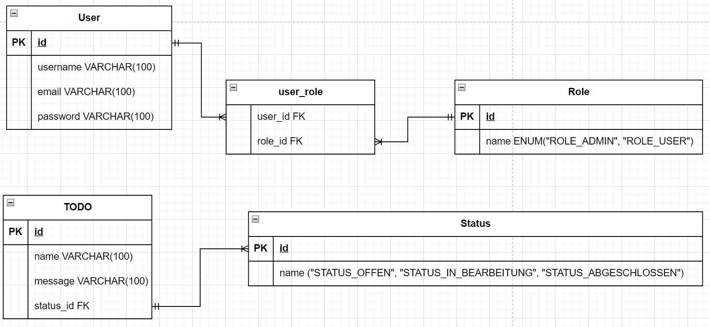

# Todo App

## Beschreibung Projekt
Dieses Projekt ist eine Todo App, welches Benutzern mit den erforderlichen Berechtigungen, Todo's "Aufgaben" zu erstellen. Die Todo's haben eine Id, eine Message und einen Status, welche man setzen kann, je nach Standpunkt des Todo's.

## Inhaltsverzeichnis
- [Todo App](#todo-app)
    - [Beschreibung Projekt](#beschreibung-projekt)
    - [Informieren](#1-informieren)
        - [Beschreibung](#beschreibung)
        - [Verwendete Technologien](#verwendete-technologien)
        - [Akzeptanzkriterien](#akzeptanzkriterien)
    - [Planung](#2-planung)
        - [Installationen](#installationen)
            - [MySQL](#mysql)
            - [Backend (Spring Boot)](#backend-spring-boot)
            - [Frontend (React)](#frontend-react)
        - [Verwendete Technologien](#verwendete-technologien-1)
    - [Entscheiden](#3-entscheiden)
        - [Beschreibung Datenbank](#beschreibung-datenbank)
        - [ERD](#erd)
        - [RBAC](#rbac-role-based-access-control)
        - [REST API](#rest-api)
        - [Frontend](#frontend)
        - [Backend](#backend)
    - [Realisierung](#4-realisierung)
        - [Tests](#tests)
            - [Frontend](#frontend-1)
            - [Backend](#backend-1)
        - [Vorhandene Tests](#vorhandene-tests-1)
    - [Kontrolle](#5-kontrolle)
        - [Sicherheit](#sicherheit)
            - [Spring Security](#spring-security)
            - [JWT](#jwt)
            - [BCrypt](#bcrypt)
            - [CORS](#cors)
            - [Hilfestellungen](#hilfestellungen)
            - [MySQL](#mysql-1)
            - [Frontend (React)](#frontend-react-1)
            - [Backend (Spring Boot)](#backend-spring-boot-1)
    - [Auswerten](#6-auswerten)
        - [Dokumentation](#dokumentation)
        - [Tests](#tests-1)
        - [Sicherheit](#sicherheit-1)
        - [Hilfestellungen](#hilfestellungen-1)
    - [Zusammenfassung](#zusammenfassung)


## 1. Informieren

### Beschreibung
- **Was:** Eine Todo-App für die Verwaltung von Aufgaben.
- **Zweck:** Benutzern mit Berechtigungen ermöglichen, Todos zu erstellen und zu verwalten.
- **Struktur:** Todos haben Id, Message und einen Status.

### Verwendete Technologien
- [React](https://reactjs.org/)
- [Spring Boot](https://spring.io/projects/spring-boot)
- [MySQL 8.0](https://www.mysql.com/)
- [MDBootstrap](https://mdbootstrap.com/)
- [JWT](https://jwt.io/)
- [Maven](https://maven.apache.org/)
- [NPM](https://www.npmjs.com/)
- [Git](https://git-scm.com/)
- [Visual Studio Code](https://code.visualstudio.com/)
- [Postman](https://www.postman.com/)

### Akzeptanzkriterien
| Wer                     | Was                           |  Warum                          |    Akzeptanzkriterien                    |
| ------------------------|-------------------------------|---------------------------------|------------------------------------------|
| Admin                   | Einloggen                     | Um seine TODOs zu verwalten     | Admin kann sich einloggen                |
| User                    | Einloggen                     | Um seine/Ihre TODOs einzusehen  | User kann sich einloggen                 |
| Admin                   | TODOs erstellen               | Um Arbeiten zu protokollieren   | Admin kann TODOS erstellen               |
| Admin                   | Stati der TODO setzen         | Um die Arbeiten zu verfolgen    | Admin sieht ein, welche TODOs offen sind |       


## 2. Planung

### Installationen
### MySQL
1. Installieren Sie [MySQL](https://dev.mysql.com/downloads/installer/)
2. (in Windows) Starten Sie den MySQL Dienst, falls dieser noch nicht gestartet ist. <br/> (in Linux) Starten Sie den mysql-Daemon mit `sudo systemctl start mysql` oder `sudo systemctl start mysql.service`
3. (in Windows) Öffnen Sie die mysql "Commandline" und loggen Sie sich ein.<br/> (in Linux) Loggen Sie sich in der Kommandozeile in mysql ein. `sudo mysql -u root -p`
3. Erstellen Sie einen neuen Benutzer
```sql
CREATE USER 'username'@'%' IDENTIFIED BY 'password';
```
4. Erstellen Sie eine neue Datenbank
```sql
CREATE DATABASE todo;
```
5. Geben Sie dem Benutzer alle Rechte auf die Datenbank
```sql
GRANT ALL PRIVILEGES ON todo.* TO 'username'@'%';
```
6. Starten Sie das Backend einmal, damit alle Tabellen erstellt werden. (Voraussetzung [Backend](#backend-spring-boot))
7. Anschliessend importieren Sie das SQL script von "TodoApp/resources/import_sql.sql" in MySQL
```
SOURCE TodoApp/resources/import_sql.sql;
```
8. Starten Sie das Backend neu.

### Backend (Spring Boot)
1. Installieren Sie [Java](https://www.java.com/de/download/)
2. Klonen Sie das Repository
```bash
git clone https://github.com/jasontermine/TodoApp.git
```
3. Navigieren Sie in den Ordner "TodoApp/backend"
```bash
cd TodoApp/backend
```
5. Fügen Sie Ihre MySQL Daten in die Datei "application.properties" ein
```properties
spring.datasource.url=jdbc:mysql://localhost:3306/todo
spring.datasource.username=username
spring.datasource.password=password
```

6. Starten Sie das Backend
```bash
./mvnw spring-boot:run
```
7. Öffnen Sie [http://localhost:8080](http://localhost:8080) um die App im Browser zu sehen.

### Frontend (React)
1. Installieren Sie [Node.js](https://nodejs.org/en/download/)
2. Installieren Sie [NPM](https://www.npmjs.com/get-npm)
3. Klonen Sie das Repository
```bash	
git clone https://github.com/jasontermine/TodoApp.git
```
4. Navigieren Sie in den Ordner "/frontend"
```bash
cd TodoApp/frontend
```
5. Installieren Sie die benötigten Pakete
```bash
npm install
```
6. Starten Sie das Frontend
```bash
npm run dev
```
7. Öffnen Sie [http://localhost:5173](http://localhost:5173) um die App im Browser zu sehen.

### Verwendete Technologien
- [Spring Security](https://spring.io/projects/spring-security)
- [JWT](https://jwt.io/)
- [BCrypt](https://en.wikipedia.org/wiki/Bcrypt)
- [CORS](https://de.wikipedia.org/wiki/Cross-Origin_Resource_Sharing)

## 3. Entscheiden

### Beschreibung Datenbank 
Die Datenbank besteht aus 5 Tabellen. Die Tabelle "user" enthält alle Benutzer. Die Tabelle "role" enthält alle Rollen. Die Tabelle "todo" enthält alle Todo's. Die Tabelle "status" enthält alle Stati, in Relation zu den Todo's. Die Tabelle "user_role" enthält die Rollen, in Relation zu den Benutzern.

### ERD 
- ER-Diagramm für die Datenbankstruktur.<br/>


### RBAC (Role-Based Access Control) 
- RBAC-Diagramm zur Visualisierung der Rollen und Berechtigungen.<br/>
Nur Benutzer mit der Admin Rolle sind Berechtigt, Todos zu erstellen, löschen und lesen. <br/>
Benutzer mit der User Rolle können Todo's nur lesen.


### REST API 
- Authentifizierung über /api/auth/signup und /api/auth/signin.
- Endpoints für die Verwaltung von Todos (/admin/todos).
- POST, GET und DELETE Methoden für Todos.<br/>

| Methode | URL | Beschreibung | Authentifizierung | Rolle| Parameter |
| --- | --- | --- | --- | --- | --- |
| POST | /api/auth/signup | Registriert einen neuen Benutzer | Nein | Keine | username, password, role |
| POST | /api/auth/signin | Loggt einen Benutzer ein | Nein | Keine | username, password |
| POST | /api/auth/signout | Loggt einen Benutzer aus | Ja | USER oder ADMIN | |
| GET | /private/todos | Gibt alle Todo's zurück | Ja | USER oder ADMIN | |
| GET | /admin/todos | Gibt alle Todo's zurück | Ja | ADMIN | |
| POST | /admin/todos/create | Erstellt ein neues Todo | Ja | ADMIN | (Optional => id : int) name : String, message : String, status : int |
| DELETE | /admin/todos/delete/{id} | Löscht ein todo | Ja | ADMIN | id : int |


### Frontend 
- Login-Seite (/) und Liste aller Todos.
- Signup-Seite (/signup) um sich zu Registrieren.
- Admin-Seite (/admin) mit Buttons zum Erstellen und Löschen von Todos.
- Private-Seite (/private) zum einsehen von den erstellten Todos.
  
| URL | Beschreibung | Authentifizierung |
| --- | --- | --- |
| / | Login Seite | Nein |
| /signup | Seite um sich registrieren zu können | Nein |
| /public | Easter Egg ;) | Nein |
| /private | Liste aller Todo's. Für Admin, besteht die möglichkeit, Todos direkt zu löschen, mittels Trash-Button  | Ja |
| /admin | Zwei buttons zur Auswahl, ob man ein Todo erstellen möchte oder eins löschen | Ja |

Das User Interface des Frontends wurde aus zeitlichen Gründen, ganz simpel gestaltet und erfüllt somit den Zweck der Endpoints und des Projekts. Die Seite "/signup" enthält einen Form, wobei sich ein neuer Benutzer registrieren kann mit der gewünschten Rolle. Die Seite "/admin" verfügt über zwei Buttons "Todo erstellen" und "Todo löschen". Diese Buttons rufen zwei verschiedene "Modals" / Formulare auf.  Diese Formulare können nach Zweck ausgefüllt werden und abgesendet werden. Nach dem Erstellen oder Löschen eines Todo's, wird der Benutzer zur "/private" Seite geschickt und die erstellten Todo's werden angezeigt. Die Seite "/private" listet für nicht-Admins nur die Todo's auf und für Admins gibt es die Option, die Todos direkt zu löschen, mittels Trash-Button.

### Backend 
- Schichten: controller, helper, model, repository, security.
- Spring Security für Authentifizierung und Autorisierung.
- Verwendung von JWT für sichere Authentifizierung.
- BCrypt für sichere Passwortverschlüsselung.
- CORS für sichere Kommunikation zwischen Frontend und Backend.

| Schicht | Beschreibung |
| --- | --- |
| controller | REST Controller |
| helper | Hilfsklasse für JWT |
| model | Datenbank Modelle |
| repository | Spring Data Repositories |
| security | Spring Security |

## 4. Realisierung

## Tests

### Frontend 
Die Tests sind im Ordner "TodoApp/frontend/src/\__tests\_\_" zu finden. Die Tests sind mit dem Framework [Vitest](https://vitest.dev/) geschrieben. Die Tests können wie folgt ausgeführt werden.
```bash
cd TodoApp/frontend
npm test
```

#### Vorhandene Tests
- state.test.js 

#### state.test.js
Dieser Test überprüft, ob die States funktional sind.


### Backend 
- JUnit und Mockito. <br />
Die Tests sind im Ordner "backend/src/test/java/com/wiss/m223" zu finden.
Die Tests sind mit dem Framework [JUnit](https://junit.org/junit5/) und [Mockito](https://site.mockito.org/) geschrieben. Die Tests können wie folgt ausgeführt werden.
```bash
cd TodoApp/backend
./mvnw test
```

#### Vorhandene Tests
Für Die folgenden Schichten, wurden Tests geschrieben:
- AdminController
- SignupRequest
- UserDetailsServiceImpl

Diese Schicht enthält fünf Tests.
Genauere Informationen zu den Tests dieser Klasse ist im Klassenkommentar zu finden.

## 5. Kontrolle

### Sicherheit
Die Sicherheit der Webanwendung wird mit folgenden Technologien gewährleistet.

### Spring Security
Spring Security ist ein Framework, das dazu dient, die Sicherheit einer Webanwendung sicherzustellen. Es bietet verschiedene Mittel, um dies zu erreichen. In diesem Projekt wird Spring Security verwendet, um sowohl die Authentifizierung als auch die Autorisierung zu handhaben.

### JWT
JWT (JSON Web Token) ist ein offener Standard, der in diesem Projekt für sichere Authentifizierung sorgt. Nach dem Login erhält der Benutzer einen verschlüsselten JWT mit Benutzer-ID und -namen, den er bei jeder Anfrage mitsendet, um die Integrität zu gewährleisten.

### BCrypt
In diesem Projekt wird der BCrypt-Algorithmus verwendet, um die Passwörter der Benutzer sicher zu verschlüsseln. BCrypt ermöglicht eine effektive Hashing-Methode, die die Sicherheit der Passwortverwaltung verbessert.

### CORS
In diesem Projekt ermöglicht der CORS-Mechanismus die nahtlose Kommunikation zwischen Frontend und Backend, indem er der Webanwendung erlaubt, sicher auf Ressourcen von einem anderen Server zuzugreifen.

### Hilfestellungen

### MySQL
Da die Datenbank durch Spring Boot generiert wurde, kam zur Entwicklung nur [MySQL](https://www.mysql.com/) zum Einsatz.

### Frontend (React)
Da ich in meinem Betrieb bereits Erfahrung habe mit Vue.js, war das entwickeln vom Frontend mit React nicht so ein Problem. Vorallem die handhabung mit den REST, States und die Logik hinter der Komponentenbaserte Webentwicklung. Trotzdem benötigte ich für gewisse sachen Hilfe von der [React Dokumentation](https://reactjs.org/docs/getting-started.html).

Aufgrund sehr begrenzter Zeit für dieses Projekt, musste ich teilweise [ChatGPT](https://chat.openai.com/) und [GitHUb Copilot](https://copilot.github.com/) nutzen.

Hilfe wurde von folgenden Mitschülern erhalten:
- Christoph Knuchel

Hilfe wurde von folgenden Lehrern erhalten:
- Sven Schirmer

### Backend (Spring Boot)
Da ich bereits Erfahrungen gesammelt habe im Modul 320 (Objektorientiert Programmieren) und Modul 295 (Backend für Applikationen realisieren), welche auch Springboot und Maven enthielten, war das realisieren des Backends für dieses Projekt nicht so Kompliziert. Jedoch habe ich von der [Spring Boot Dokumentation](https://spring.io/projects/spring-boot) etwas hilfe benötigt.

Aufgrund sehr begrenzter Zeit für dieses Projekt, musste ich teilweise [ChatGPT](https://chat.openai.com/) und [GitHUb Copilot](https://copilot.github.com/) nutzen.

Hilfe wurde von folgenden Mitschülern erhalten (Gott sei Dank):
- Christop Knuchel

Hilfe wurde von folgenden Lehrern erhalten:
- Sven Schirmer

## 6. Auswerten

### Dokumentation
- Beinhlatet klare Erklärungen zu Datenbank, Frontend, Backend, RBAC und REST API.

### Tests
- Erfolgreiche Frontend- und Backend-Tests.
- Frontend- sowie Backend-Tests sind erfolgreich und testen wichtige Funktionen. 

### Sicherheit
- Erfolgreiche Anwendung von Spring Security, JWT, BCrypt und CORS.

### Hilfestellungen
- Dank der Hilfe des Mitschülers und des Donzenten, konnte das Projekt Erfolgreich abgeschlossen werden. 

## Zusammenfassung
Die Todo-App wurde erfolgreich entwickelt und umfasst alle erforderlichen Funktionen. Die IPERKA-Methode half bei einer strukturierten Planung und Umsetzung des Projekts. Trotzdem gab es zu beginn schwierigkeiten, da die Erfahrung mit Java und React fehlte. Jedoch konnte ich micht durchkämpfen in dieser sehr begrenzter Zeit und konnte das Projekt abschliessen.
